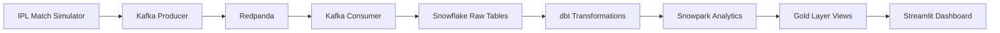

# 🏏 IPL Real-Time Analytics Platform


A real-time IPL analytics platform that simulates live cricket matches using **Kafka**, **Redpanda**, **Snowflake**, **dbt**, **Snowpark**, and **Streamlit**.

The platform streams every ball of an IPL season in real time, processes events through Kafka, stores them in Snowflake, transforms the data using dbt, and visualizes live analytics through an interactive Streamlit dashboard.

---

## 🚀 Features

* Live ball-by-ball IPL simulation
* Real-time Kafka event streaming
* Redpanda as Kafka-compatible streaming platform
* Snowflake cloud data warehouse
* Snowpark data processing
* dbt transformations
* Live Streamlit dashboard
* Dynamic Points Table
* Live Orange Cap & Purple Cap
* Match Results
* Playoff Qualification
* Champion Prediction
* Win Probability
* Player Statistics
* Team Analytics

---

## 🛠 Tech Stack

* Python
* Apache Kafka
* Redpanda
* Snowflake
* Snowpark
* dbt
* SQL
* Streamlit
* Pandas

---

## 📂 Project Structure

```text
IPL-Real-Time-Analytics-Platform/
│
├── dashboard/
├── producer/
├── data/
├── IPL_DBT_PROJECT/
├── snowflake/
├── docs/
└── README.md
```

---


## 🏗️ System Architecture



## 📊 Dashboard Features

* Live Scorecard
* Current Batters
* Current Bowler
* Last Over Summary
* Win Probability
* Projected Score
* Points Table
* Playoffs
* Orange Cap
* Purple Cap
* Team Analytics
* Match Results

---

## 📷 Dashboard Preview

*(Add screenshots here.)*

---

## ▶️ How to Run

1. Start Redpanda
2. Start Kafka Producer
3. Start Kafka Consumer
4. Start Snowflake Loader
5. Run Streamlit Dashboard

---

## 👨‍💻 Author

**Chinmaya Rout**

B.Tech – Computer Science (Data Science)

Passionate about Data Engineering, Cloud Analytics, Machine Learning and Real-Time Data Processing.
